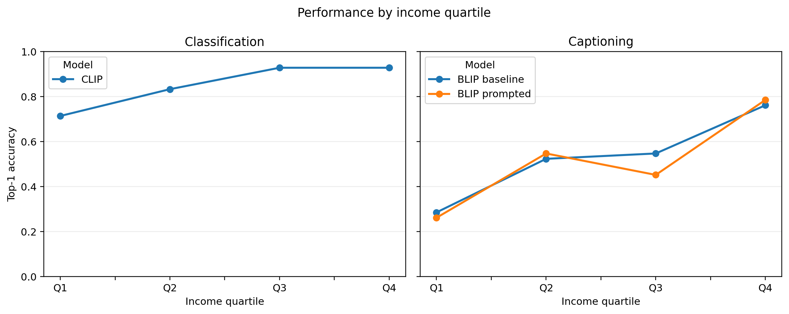
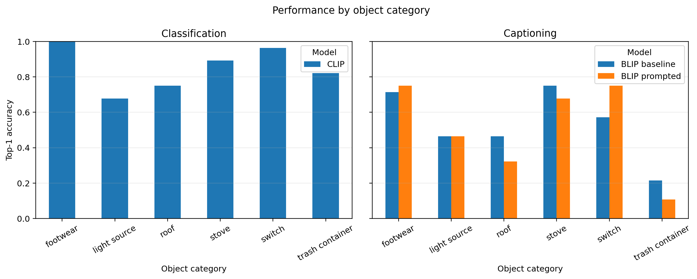

# Divya's Short-Paper Sections

> Scope: Introduction, Dataset, Methodology, and Quantitative Results for CLIP,
> BLIP, and Qwen. Bracketed result fields must only be replaced after the full
> 168-image experiment has completed and been checked.

## 1. Introduction and Problem Motivation

Vision-language models are often evaluated on standard benchmark images, but
the same household object can look very different across homes. A stove may be
a modern built-in appliance, a portable gas burner, or a simple solid-fuel
setup. Similar visual variation occurs for roofs, light sources, switches,
footwear, and waste containers. Models trained mainly on common web images may
therefore recognise familiar versions of an object more reliably than versions
that appear less often in their training data.

This project examines whether such differences are visible across household
income groups in Dollar Street. The main research question is: **How does the
performance of pretrained vision-language models on household-object
recognition and captioning vary across four income quartiles when object
category frequency is held constant?** We treat this as an empirical question;
the experiment does not assume beforehand that lower-income images must produce
worse results.

We construct a fixed, balanced subset and compare models representing different
vision-language approaches. Divya's quantitative evaluation covers CLIP
zero-shot classification, BLIP captioning with and without a label-free prompt,
and Qwen2.5-VL forced-choice classification and captioning. The broader group
benchmark also contains baselines assigned to the other project member. Our
contribution is not a newly trained model. It is a controlled and reproducible
comparison showing whether any observed income-related pattern is consistent
across tasks and model designs.

## 2. Dataset

We use images and metadata from the 1,600-row Dollar Street test split exposed
by the Hugging Face dataset viewer. Dollar Street's income value represents
monthly consumption per adult equivalent in PPP-adjusted US dollars rather
than reported salary. After excluding 45 multi-class rows and records without
the required fields, quartiles were calculated over 1,555 eligible records:
Q1 ≤ 210.67, Q2 ≤ 685.00, Q3 ≤ 1,841.00, and Q4 > 1,841.00. The fixed study
subset contains 168 unique images from 44 countries. It covers six household
object categories: roof, light source, stove, trash container, switch, and
footwear. Income values are divided into four quartiles, Q1 to Q4. Each
quartile contains 42 images, and every category–quartile combination contains
exactly seven images. Each category therefore contributes 28 images overall.

The balanced design prevents one income quartile from receiving a higher score
simply because it contains more examples of an easier category. The manifest
stores the original image identifier, source row, object label, income,
quartile, country, region, and accepted caption terms. Multi-class source rows
were excluded to reduce label ambiguity. All 168 selected files were checked
for uniqueness and readability before evaluation.

The subset should not be treated as representative of the world population.
Although it spans 44 countries, regional counts are unequal: 64 images are
from Asia, 44 from the Americas, 39 from Africa, and 21 from Europe. For this
reason, income quartile is the primary comparison and region is only a
secondary descriptive variable.

## 3. Methodology

### 3.1 Models and tasks

CLIP (`openai/clip-vit-base-patch32`) is used for six-way zero-shot
classification. Each image is compared with the six text prompts using the
template `a photo of a household {label}`. The label with the highest
probability is the top-1 prediction, and the rank of the correct label is also
saved. Its standard processor resizes the shorter edge to 224 pixels, applies a
224 × 224 centre crop, and uses the checkpoint's channel normalisation.

BLIP (`Salesforce/blip-image-captioning-base`) generates two captions per
image. The baseline caption is unprompted. The second uses the prefix `the main
household object in this image is`. This prompt does not reveal the correct
category, income, country, or region. Comparing the two outputs tests whether a
small, training-free prompt helps the model mention the main object. Its
standard processor resizes images to 384 × 384 and applies the checkpoint's
normalisation. Generation is deterministic and limited to 30 new tokens.

Qwen2.5-VL-3B-Instruct is evaluated on both classification and captioning. For
classification, it receives the image and the same fixed list of six candidate
labels and must return one label only. For captioning, it receives a short
instruction to describe the main household object without guessing location or
income. Greedy decoding is used for reproducibility. Following the model's
documented resolution controls, image inputs are restricted to 256–1,280 visual
tokens (200,704–1,003,520 pixels) to keep inference reproducible and feasible.
No model is trained or fine-tuned on the study images.

### 3.2 Evaluation

Classification performance is measured using top-1 accuracy. CLIP's
correct-label rank is retained as a secondary diagnostic. Captioning is scored
using accepted-term recall: a caption is counted as a match when it contains a
predefined term or synonym associated with the study category. For example,
`lantern` can count for light source. Whole-term matching is used to avoid
partial-word errors. Because this automatic measure does not capture full
caption quality, half of the caption outputs are assigned to Divya for manual
review and the other half to the second reviewer.

Scores are calculated for every model and task by income quartile and object
category. The main gap is Q4 minus Q1. A category-stratified bootstrap with
2,000 resamples and random seed 2026 is used to obtain a 95% interval for this
gap. The interval describes uncertainty within the selected sample; it does
not make the sample population-representative. Raw outputs, prompts, checkpoint
names, predictions, and run metadata are saved for reproducibility.

The completed CLIP/BLIP run used Python 3.13.5, PyTorch 2.12.1,
Transformers 5.13.0, NumPy 2.3.3, pandas 2.3.3, and Pillow 11.3.0 on CPU.
Checkpoint files were loaded from their public model repositories. The full
manifest and all output-row counts were validated before analysis.

## 4. Quantitative Results

> **Do not submit this section with placeholders.** Populate it from
> `results/divya/analysis/` after validating the full run.

The completed CLIP and BLIP runs each evaluated all 168 images. CLIP correctly
classified 143 images, giving an overall top-1 accuracy of **85.1%**. BLIP's
accepted-term recall was **53.0%** (89/168) without the prompt and **51.2%**
(86/168) with the label-free object prompt. The prompt therefore produced a
small overall decrease of 1.8 percentage points rather than an improvement.
Qwen values remain **pending** and will be inserted only after its full run has
passed the same row-count and metadata checks.

| Model and task | Q1 | Q2 | Q3 | Q4 | Overall |
|---|---:|---:|---:|---:|---:|
| CLIP classification accuracy | 71.4% | 83.3% | 92.9% | 92.9% | 85.1% |
| BLIP baseline caption recall | 28.6% | 52.4% | 54.8% | 76.2% | 53.0% |
| BLIP prompted caption recall | 26.2% | 54.8% | 45.2% | 78.6% | 51.2% |
| Qwen classification accuracy | pending | pending | pending | pending | pending |
| Qwen caption recall | pending | pending | pending | pending | pending |

For all three completed conditions, the primary score was higher in Q4 than in
Q1. The Q4–Q1 difference was **21.4 percentage points** for CLIP classification
(95% category-stratified bootstrap interval: 7.1 to 35.7), **47.6 points** for
BLIP baseline caption recall (31.0 to 64.3), and **52.4 points** for BLIP
prompted caption recall (38.1 to 66.7). These are observed differences within
the selected, balanced subset. They do not by themselves show that income
caused the errors or that the values generalise to all households.

CLIP's category accuracy ranged from **67.9% for light sources** to **100% for
footwear**. For BLIP, baseline object recall was highest for stoves (75.0%) and
lowest for trash containers (21.4%). The prompt improved recall for switches
from 57.1% to 75.0% but reduced it for roofs from 46.4% to 32.1% and for trash
containers from 21.4% to 10.7%. This mixed pattern explains why the prompt did
not improve the overall caption score. Figure 1 shows the income-quartile
scores, and Figure 2 presents the category breakdown.

*Figure 1. CLIP top-1 accuracy and BLIP accepted-term recall by income
quartile. Each quartile contains 42 images.*

*Figure 2. CLIP top-1 accuracy and BLIP accepted-term recall by object
category. Each category contains 28 images.*

The automatic caption metric was checked on Divya's deterministic half of the
data: 84 images and 168 BLIP captions. No automatic match was a clear semantic
false positive. However, **19 automatic misses were clear false negatives**—10
baseline and 9 prompted captions—because they used valid wording such as
`flip-flops`, `Crocs`, `bucket`, `basket`, `garbage bag`, or a misspelled form
of `chandelier`. Twelve additional captions were marked uncertain because the
image or source label did not show one clear trash container or because the
caption named a related electrical object.

Counting only clear `yes` decisions, semantic target recall on the reviewed
half was **65.5%** (55/84) for baseline BLIP and **61.9%** (52/84) for prompted
BLIP. If uncertain cases are included as an upper bound, the values are 72.6%
and 69.0%. Thus, the narrow accepted-term metric underestimates both systems,
but the review does not reverse the finding that the prompt failed to improve
caption performance. One prompted caption correctly identified Crocs but was
marked disfluent because it repeated the word many times.

### Quantitative-results checklist

- [ ] Confirm all 168 images were evaluated by CLIP, BLIP, and Qwen. CLIP and
      BLIP are complete; Qwen is pending.
- [ ] Confirm expected row counts: CLIP 168, Qwen classification 168, Qwen
      captioning 168, BLIP baseline 168, BLIP prompted 168. Current verified
      counts are CLIP 168, BLIP baseline 168, and BLIP prompted 168.
- [ ] Fill every bracketed value from saved CSV files.
- [ ] Refer to every included table and figure in the text.
- [ ] Report sample counts with quartile and category scores.
- [ ] Describe associations, not causes or universal fairness conclusions.
- [x] Record the completed manual-review counts.
