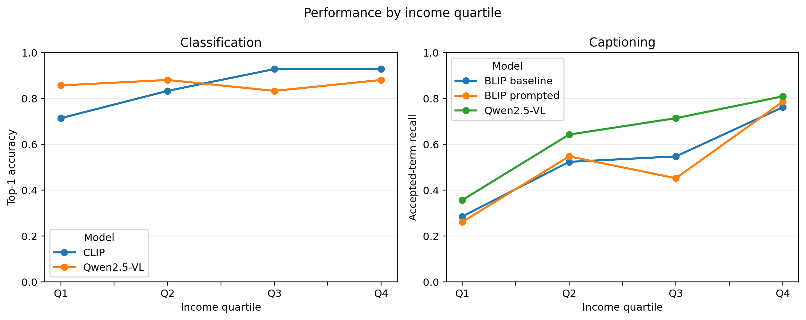

# Income-Related Performance Gaps in Vision-Language Models

## 1. Introduction

The same household object can look very different across homes. A stove may be
a built-in appliance, a portable gas burner, or a simple solid-fuel setup.
Similar variation appears in roofs, light sources, switches, footwear, and
waste containers. Vision-language models trained mainly on common web images
may therefore recognize familiar versions more reliably than less common ones.
Prior Dollar Street work found socioeconomic variation in CLIP-based alignment
and retrieval (Nwatu et al., 2023); we test whether a similar pattern appears
across classification and captioning models.

We ask: **How does pretrained vision-language model performance on household-
object recognition and captioning vary across four Dollar Street income
quartiles when category frequency is held constant?** We treat this as an
empirical question rather than assuming that a gap must exist. Divya's study
compares CLIP zero-shot classification, BLIP captioning with and without a
label-free prompt, and Qwen2.5-VL classification and captioning. The contribution
is a controlled, reproducible benchmark, not a newly trained model.

## 2. Method

### 2.1 Dataset

We used the 1,600-row Dollar Street test split (Rojas et al., 2022). Income is
monthly consumption per adult equivalent in PPP-adjusted US dollars, not
salary. We excluded 45
multi-class rows and calculated quartiles over 1,555 eligible records: Q1 <=
210.67, Q2 <= 685, Q3 <= 1,841, and Q4 > 1,841. The fixed subset contains 168
unique images from 44 countries and six categories: roof, light source, stove,
trash container, switch, and footwear. Each quartile has 42 images, and every
category-quartile cell has seven images. This balance prevents a quartile from
scoring higher simply because it contains more examples of an easier category.
All files were checked for uniqueness and readability. The sample is not
population-representative, and regional counts are unequal, so income quartile
is the primary comparison.

### 2.2 Models and tasks

CLIP (`openai/clip-vit-base-patch32`; Radford et al., 2021) performs six-way
zero-shot classification using `a photo of a household {label}`. Its standard
processor resizes the shorter edge to 224 pixels and applies a 224 x 224 center
crop. BLIP (`Salesforce/blip-image-captioning-base`; Li et al., 2022) produces
an unprompted caption and a caption beginning `the main household object in
this image is`. The prompt does not reveal the category, income, or location.
BLIP uses its standard 384 x 384 processor and deterministic generation with at
most 30 new tokens.

Qwen2.5-VL-3B-Instruct (Qwen Team, 2025) receives the same six labels for
forced-choice classification and a short, location-neutral caption instruction.
Greedy decoding is used, and every image is limited to 256 visual tokens
(200,704 pixels). No model is trained or fine-tuned. Experiments run on CPU on
an Apple M4 MacBook Air with 16 GB memory because MPS is unavailable in this
runtime. The environment uses Python 3.13.5, PyTorch 2.12.1, and Transformers
5.13.0.

### 2.3 Evaluation

Classification uses top-1 accuracy; CLIP's correct-label rank is retained as a
secondary diagnostic. Captioning uses accepted-term recall: a caption matches
when it contains a predefined category term or synonym, with whole-term
matching to prevent partial-word errors. Divya also reviews the even-positioned
half of sorted image IDs (84 images) to check semantic target correctness,
caption quality, and automatic-metric errors.

We report scores by income quartile and category. The main gap is Q4 minus Q1,
with a 95% category-stratified bootstrap interval from 2,000 resamples using
seed 2026. Raw outputs, prompts, metadata, and checkpoints are saved. The Qwen
runner saves both tasks after every image and resumes only when the manifest,
prompts, model, and preprocessing configuration match.

## 3. Results

CLIP classified 143/168 images correctly (**85.1%**), while Qwen classified
145/168 correctly (**86.3%**). Accepted-term caption recall was **53.0%**
(89/168) for baseline BLIP, **51.2%** (86/168) for prompted BLIP, and **63.1%**
(106/168) for Qwen. The label-free BLIP prompt therefore reduced overall recall
by 1.8 percentage points rather than improving it.

| Model and task | Q1 | Q2 | Q3 | Q4 | Overall |
|---|---:|---:|---:|---:|---:|
| CLIP classification accuracy | 71.4% | 83.3% | 92.9% | 92.9% | 85.1% |
| BLIP baseline caption recall | 28.6% | 52.4% | 54.8% | 76.2% | 53.0% |
| BLIP prompted caption recall | 26.2% | 54.8% | 45.2% | 78.6% | 51.2% |
| Qwen classification accuracy | 85.7% | 88.1% | 83.3% | 88.1% | 86.3% |
| Qwen caption recall | 35.7% | 64.3% | 71.4% | 81.0% | 63.1% |

*Table 1. Primary scores by income quartile; each quartile contains 42 images.*

The Q4-Q1 gap was **21.4 points** for CLIP classification (95% interval: 7.1 to
33.4) but only **2.4 points** for Qwen classification (-7.1 to 14.3). Caption
gaps were larger: **47.6 points** for baseline BLIP (31.0 to 64.3), **52.4** for
prompted BLIP (38.1 to 66.7), and **45.2** for Qwen (28.6 to 61.9). These are
associations within the selected images. They do not by themselves show that
income caused the errors or that the values generalize to all households.

*Figure 1. Classification accuracy and accepted-term caption recall by income
quartile (n = 42 per quartile).*

Category results show why one overall value is insufficient. CLIP ranged from
67.9% for light sources to 100% for footwear. Qwen classification ranged from
39.3% for roofs to 100% for footwear, stoves, and trash containers. Qwen
caption recall was highest for stoves (85.7%) and lowest for roofs (42.9%).
The BLIP prompt helped switches (57.1% to 75.0%) but hurt roofs (46.4% to
32.1%) and trash containers (21.4% to 10.7%), so it was not reliable.

Divya's completed BLIP semantic audit contains 84 images and 168 captions. The
automatic metric had no clear false positive but missed 19 clear semantic
matches, including `flip-flops`, `Crocs`, `bucket`, `basket`, and `garbage bag`.
Twelve captions were uncertain. Strict semantic target recall was 65.5% (55/84)
for baseline BLIP and 61.9% (52/84) for prompted BLIP; upper bounds including
uncertain cases were 72.6% and 69.0%. In the matched Qwen audit, automatic
recall was 57.1% (48/84), strict semantic recall was 70.2% (59/84), and 11 cases
were uncertain (upper bound 83.3%). It contained 15 clear metric false
negatives, one false positive, and no disfluent caption. Thus the narrow term
list underestimates all three caption settings but does not reverse the failed
BLIP-prompt finding.
