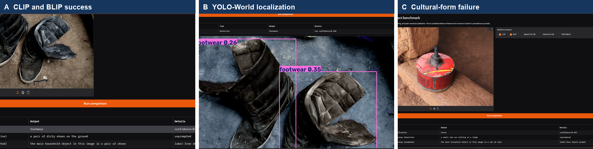

# Income-Related Performance Gaps in Vision-Language Models

**Diya Tiwari and Riya Katikar**
Computer Vision Project Short Paper

## 1 Introduction and problem motivation

Household objects do not have one standard appearance. A stove may be a built-in appliance, a portable gas burner, or a solid-fuel setup; roofs, switches, light sources, footwear, and waste containers also vary across homes. Models trained mainly on web image-text pairs may recognize familiar forms more reliably than less common ones. Nwatu et al. (2023) reported income-related differences in CLIP alignment and retrieval on Dollar Street. We extend that question to classification, caption generation, and open-vocabulary detection.

We ask: **How does pretrained model performance on six household-object categories vary across four Dollar Street income quartiles when category frequency is held constant?** We test CLIP, BLIP, Qwen2.5-VL, InternVL3.5, and YOLO-World without training or fine-tuning. The aim is a controlled benchmark, not a claim that income causes model errors.

## 2 Methodology

### 2.1 Dataset and preprocessing

We used the 1,600-row public Dollar Street test split (Rojas et al., 2022). Income is monthly consumption per adult equivalent in PPP-adjusted US dollars, not salary. After excluding 45 multi-label rows, quartiles were calculated over 1,555 eligible records: Q1 <= 210.67, Q2 <= 685, Q3 <= 1,841, and Q4 > 1,841. A deterministic subset contains 168 unique images from 44 countries and six categories: roof, light source, stove, trash container, switch, and footwear. Every one of the 24 category-quartile cells contains seven images, giving 42 images per quartile and 28 per category. This removes category-frequency imbalance from the income comparison but does not make the subset population-representative. Regional counts are unequal, so region is not used as a primary comparison.

CLIP used its checkpoint processor (short-edge resize to 224 pixels and 224 x 224 centre crop); BLIP used its 384 x 384 processor. Qwen used a fixed 256-visual-token budget (200,704 pixels). InternVL resized each RGB image to 448 x 448 with bicubic interpolation, converted it to a tensor, and applied ImageNet mean and standard-deviation normalization. YOLO-World received the RGB array through the standard Ultralytics prediction pipeline. The fixed manifest, image IDs, prompts, outputs, and run metadata are saved in the repository.

### 2.2 Models and tasks

CLIP ViT-B/32 (Radford et al., 2021) performed six-way zero-shot classification with the proposal template `a photo of a {label}`. The exact template was rerun after integration; this corrected run supersedes the earlier pilot wording. BLIP-base (Li et al., 2022) generated an unprompted caption and a caption starting with the label-free prefix `the main household object in this image is`.

Qwen2.5-VL-3B-Instruct (Bai et al., 2025) and InternVL3.5-2B (Wang et al., 2025) used the same forced-choice classification instruction and the same short, location-neutral caption instruction. Decoding was deterministic. YOLO-World-small-v2 (Cheng et al., 2024) received the same six text labels at a fixed 0.25 confidence threshold. Dollar Street has no bounding boxes, so YOLO-World is evaluated only as an image-level correct-class detection baseline; mAP and IoU would be invalid here.

### 2.3 Evaluation and reproducibility

Classification uses top-1 accuracy. Captioning uses accepted-term recall: a caption matches if it includes a predeclared category term or synonym using whole-term matching. Because this narrow vocabulary can miss valid descriptions, two raters independently reviewed all 336 BLIP captions for object correctness, non-informativeness, and hallucination, then adjudicated disagreements. We report raw agreement and Cohen's kappa. A separate deterministic 84-image audit checked Qwen captions. Detection uses image-level correct-class hit rate.

For every condition we report overall, quartile, and category scores. The primary gap is Q4 minus Q1 with a 95% category-stratified bootstrap interval from 2,000 resamples using seed 2026. All 1,344 prediction rows were checked for complete coverage, unique image-model-task keys, and non-missing metrics. Experiments used public checkpoints; CLIP, BLIP, Qwen, and YOLO-World ran locally, while InternVL ran on CUDA.

## 3 Results and analysis

| Model and task | Q1 | Q2 | Q3 | Q4 | Overall |
|---|---:|---:|---:|---:|---:|
| CLIP classification | 76.2 | 81.0 | 95.2 | 92.9 | **86.3** |
| Qwen classification | 85.7 | 88.1 | 83.3 | 88.1 | **86.3** |
| InternVL classification | 88.1 | 92.9 | 78.6 | 88.1 | **86.9** |
| YOLO-World detection | 11.9 | 14.3 | 14.3 | 21.4 | **15.5** |
| BLIP baseline caption recall | 28.6 | 52.4 | 54.8 | 76.2 | **53.0** |
| BLIP prompted caption recall | 26.2 | 54.8 | 45.2 | 78.6 | **51.2** |
| Qwen caption recall | 35.7 | 64.3 | 71.4 | 81.0 | **63.1** |
| InternVL caption recall | 42.9 | 59.5 | 66.7 | 64.3 | **58.3** |

*Table 1. Scores (%) by income quartile; n = 42 images per quartile.*

The three classifiers had similar overall accuracy (86.3-86.9%), but not the same income pattern. CLIP's Q4-Q1 gap was 16.7 percentage points (95% CI 2.4 to 28.6), while Qwen's 2.4-point gap (-7.1 to 14.3) and InternVL's 0.0-point gap (-9.5 to 9.5) included zero. This shows why one model cannot represent the behavior of a whole model family.

Automatic caption recall increased from Q1 to Q4 for all captioning conditions. Gaps were 47.6 points for BLIP baseline (31.0 to 64.3), 52.4 for prompted BLIP (38.1 to 66.7), 45.2 for Qwen (28.6 to 61.9), and 21.4 for InternVL (4.7 to 38.1). However, the full two-rater BLIP review changed the size of the result: adjudicated object correctness was 80.4% for baseline and 83.9% for prompted captions, compared with automatic recalls of 53.0% and 51.2%. Baseline object correctness rose from 78.6% in Q1 to 88.1% in Q4; prompted correctness rose from 73.8% to 90.5%. The prompt therefore reduced accepted-term recall by 1.8 points but improved human-rated object correctness by 3.6 points and reduced hallucinations from 16.7% to 12.5%. Object-correct agreement was 89.3% with kappa 0.65; hallucination agreement was 94.0% with kappa 0.77. The metric was too narrow to judge caption quality by itself.

Category analysis exposed different weaknesses. CLIP was lowest on light sources (60.7%); Qwen and InternVL were lowest on roofs (39.3% and 50.0%). YOLO-World reached 57.1% for footwear and 25.0% for stoves but 0% for roofs, light sources, and switches, producing only 26 correct-class detections overall. This is a useful weak baseline, but its output is not comparable to box-level detector benchmarks because no ground-truth boxes exist.

Failure cases often involved local object forms and label ambiguity. A small red fuel can was classified by CLIP as a stove while BLIP called it a can, showing that the source label and visible object can support different readings. In another case, a waste container was described as a bucket or basket and counted wrong by the term list despite being understandable. Roof images were sometimes classified as light sources when the roof occupied little of the frame. These examples support manual review and category-level reporting rather than relying only on a single aggregate score.

*Figure 2. Qualitative evidence from the Gradio demo: a shared CLIP/BLIP footwear success, correct YOLO-World footwear localization, and a culturally specific fuel-can case where the source label and visible form are difficult to align.*

## 4 Discussion and limitations

The strongest result is not that every model has the same income gap. CLIP and all automatic caption metrics showed higher Q4 than Q1 performance, but the instruction-following classifiers were nearly flat across quartiles. Caption conclusions also depended strongly on the metric: accepted-term recall exaggerated the BLIP gap because valid cultural synonyms were missed. The unsuccessful automatic prompt result is retained, together with the different human-review result.

The study is limited to 168 selected images and six categories. Balancing controls category frequency but not country, region, scene complexity, image quality, or within-category visual form. Quartiles are defined within the exposed test split, and the bootstrap interval measures uncertainty for this selected benchmark only. Income is associated with the images but was never shown to a model. Results therefore do not establish that income caused errors and should not be generalized to all households. The Gradio demo supports uploaded images and all five baselines, but it is an illustration of model behavior rather than another evaluation dataset.

## Appendix A Related work and positioning

Dollar Street was introduced as a geographically and socioeconomically diverse dataset of household objects with country, region, and income metadata (Rojas et al., 2022). Nwatu et al. (2023) then evaluated CLIP on Dollar Street using image-text alignment and prompt-based retrieval, reporting lower performance for poorer groups. Our study is closest to that work but differs in three ways: it fixes category frequency across four income quartiles, evaluates a six-way recognition task rather than only alignment or retrieval, and compares contrastive, generative, instruction-following, and detection model families on the same images.

CLIP learns aligned image and text representations from large-scale web pairs and enables prompt-based zero-shot recognition (Radford et al., 2021). BLIP combines image-text understanding and generation and improves noisy web supervision through generated-caption filtering (Li et al., 2022). We use CLIP as the direct link to prior Dollar Street work and BLIP as a pretrained captioning baseline; neither is fine-tuned.

Qwen2.5-VL adds instruction-following visual understanding and flexible image resolution (Bai et al., 2025). InternVL3.5 is a newer multimodal family designed for strong perception and reasoning with efficient deployment variants (Wang et al., 2025). Testing compact public checkpoints under one forced-choice prompt lets us ask whether a CLIP pattern continues in general-purpose VLMs. The answer is mixed: both instruction-following classifiers had much smaller Q4-Q1 differences than CLIP, while their caption metrics still favored Q4.

YOLO-World performs open-vocabulary detection from text prompts (Cheng et al., 2024). It adds a different computer-vision task and produces qualitative boxes for the demo. Because our source data has image-level labels only, we deliberately report hit rate instead of mAP or IoU. This methodological restriction separates our benchmark from standard object-detection evaluations and prevents unsupported localization claims.

Our contribution is therefore a controlled cross-model benchmark, not a new architecture or a replication of every prior task. It also shows that conclusions depend on task and evaluation design: the same BLIP prompt looked worse under term recall but better after two-rater semantic review. That finding extends prior socioeconomic evaluation by making metric choice part of the analysis.

| Study | Data and scope | Models and tasks | Difference in our study |
|---|---|---|---|
| Rojas et al. (2022) | Full Dollar Street dataset | Dataset benchmarks | We use a fixed, category-balanced evaluation subset. |
| Nwatu et al. (2023) | Dollar Street income ranges | CLIP alignment and retrieval | We compare five models across recognition, captioning, and detection. |
| This work | 168 images; 24 balanced cells | CLIP, BLIP, Qwen, InternVL, YOLO-World | We add cross-model gaps, human caption review, failure cases, and a demo. |

*Table 2. Positioning against the closest Dollar Street studies.*

### References

1. Bai, S., et al. (2025). Qwen2.5-VL Technical Report. arXiv:2502.13923.
2. Cheng, T., et al. (2024). YOLO-World: Real-Time Open-Vocabulary Object Detection. CVPR, 16901-16911.
3. Li, J., Li, D., Xiong, C., and Hoi, S. (2022). BLIP: Bootstrapping Language-Image Pre-training for Unified Vision-Language Understanding and Generation. ICML, 12888-12900.
4. Nwatu, J., Ignat, O., and Mihalcea, R. (2023). Bridging the Digital Divide: Performance Variation across Socio-Economic Factors in Vision-Language Models. EMNLP, 10686-10702.
5. Radford, A., et al. (2021). Learning Transferable Visual Models From Natural Language Supervision. ICML, 8748-8763.
6. Rojas, W. A. G., et al. (2022). The Dollar Street Dataset: Images Representing the Geographic and Socioeconomic Diversity of the World. NeurIPS Datasets and Benchmarks.
7. Wang, W., et al. (2025). InternVL3.5: Advancing Open-Source Multimodal Models. arXiv:2508.18265.
